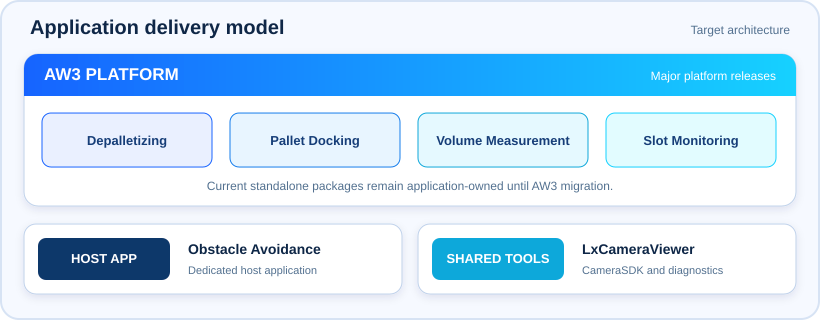

<p align="center"></p>

<h1 align="center">MRDVS Application Algorithms</h1>

<p align="center"><strong>Application documentation, verified downloads, and release history for MRDVS 3D vision products.</strong></p>

<p align="center">
  <a href="depalletizing/README.md"></a>
  <a href="pallet-docking/README.md"></a>
  <a href="volume-measurement/README.md"></a>
  <a href="slot-monitoring/README.md"></a>
  <a href="obstacle-avoidance/README.md"></a>
  <a href="aw3/README.md"></a>
</p>

## Latest downloads

| Application | Current version | Package | Release note |
| --- | --- | --- | --- |
| [**Depalletizing**](depalletizing/README.md) | `3.0.1` · Standalone | [Download ZIP](https://github.com/Lanxin-MRDVS/Application-Algorithms/releases/download/Depalletizing-Algorithm-V3.0.1/AW3-V3.0.1-20260624.zip) | [3.0.1](depalletizing/releases/v3.0.1.md) |
| [**Pallet Docking**](pallet-docking/README.md) | `PalletPro 1.4.8_260828` · Windows | [Download EXE](https://github.com/Lanxin-MRDVS/Application-Algorithms/releases/download/PalletPro/PalletPro-install-v1.4.8_260828.exe) | [1.4.8_260828](pallet-docking/releases/v1.4.8_260828.md) |

Packages are stored in **GitHub Releases**, not in the Git source tree. Open [Latest Downloads](latest-downloads/README.md) for the current package index or the owning application's `releases/` folder for version history.

## Applications

| Application | Latest guide | Current package | Release note |
| --- | --- | --- | --- |
| [**Depalletizing**](depalletizing/README.md) | [Deployment Guide](depalletizing/docs/deployment-guide.md) | [Standalone 3.0.1](https://github.com/Lanxin-MRDVS/Application-Algorithms/releases/download/Depalletizing-Algorithm-V3.0.1/AW3-V3.0.1-20260624.zip) | [3.0.1](depalletizing/releases/v3.0.1.md) · [History](depalletizing/releases/README.md) |
| [**Pallet Docking**](pallet-docking/README.md) | [User Guide](pallet-docking/docs/user-guide.md) | [PalletPro 1.4.8_260828](https://github.com/Lanxin-MRDVS/Application-Algorithms/releases/download/PalletPro/PalletPro-install-v1.4.8_260828.exe) | [1.4.8_260828](pallet-docking/releases/v1.4.8_260828.md) · [History](pallet-docking/releases/README.md) |
| [**Volume Measurement**](volume-measurement/README.md) | [Overview](volume-measurement/README.md) | _Not published_ | [History](volume-measurement/releases/README.md) |
| [**Slot Monitoring**](slot-monitoring/README.md) | [User Guide](slot-monitoring/docs/user-guide.md) | _Not published_ | [History](slot-monitoring/releases/README.md) |
| [**Obstacle Avoidance**](obstacle-avoidance/README.md) | [Deployment Guide](obstacle-avoidance/docs/deployment-guide.md) | _Not published_ | [History](obstacle-avoidance/releases/README.md) |

## Required tools

| Tool | Use | Download | Guide |
| --- | --- | --- | --- |
| [**LxCameraViewer**](tools/lxcameraviewer/README.md) | Camera discovery, networking, parameter setup, and image or point-cloud verification. | [Windows installer](https://github.com/Lanxin-MRDVS/CameraSDK/releases/download/SDK-V2.4.60/MRDVS-2.4.60.260126-windows-installer.exe) | [User Guide](tools/lxcameraviewer/docs/user-guide.md) |
| [**CameraSDK**](https://github.com/Lanxin-MRDVS/CameraSDK) | Host-side camera APIs, SDK packages, and integration examples. | [SDK repository](https://github.com/Lanxin-MRDVS/CameraSDK#english) | [English documentation](https://github.com/Lanxin-MRDVS/CameraSDK#english) |

## Application delivery model

<p align="center"></p>

AW3 is the target runtime for **Depalletizing, Pallet Docking, Volume Measurement, and Slot Monitoring**. The currently published Depalletizing and Pallet Docking packages are standalone deliveries outside AW3. Future major shared releases belong to AW3; application-specific patches remain under the affected application. Obstacle Avoidance has its own host-application lifecycle.

Maintainers: [Release policy](user-guides/release-policy.md) · [Release-note template](user-guides/release-note-template.md) · [Repository structure](user-guides/repository-structure.md)

## Repository layout

```text
depalletizing/       Depalletizing guide and release history
pallet-docking/      Pallet Docking guide and release history
volume-measurement/  Volume Measurement guide and release history
slot-monitoring/     Slot Monitoring guide and release history
obstacle-avoidance/  Obstacle Avoidance guide and release history
aw3/                 AW3 platform releases
tools/               Shared camera and integration tools
user-guides/         Current documentation index and shared visuals
latest-downloads/    Current verified installation packages
```

Every application folder follows the same contract: `README.md` is the entry page, `docs/` stores the current guide, and `releases/` stores the latest and historical version notes.

---

<sub>Hangzhou Lanxin Technology Co., Ltd. & MRDVS Co., Ltd. · All Rights Reserved. · Last updated: September 2026</sub>
