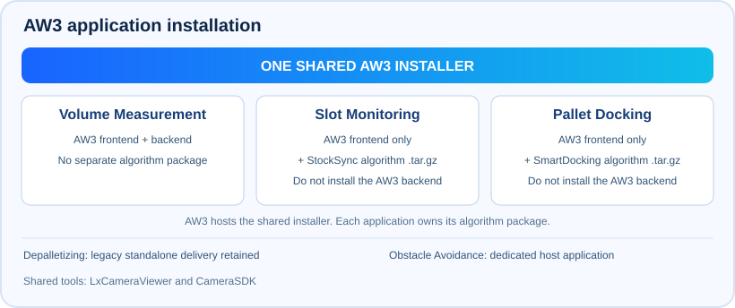

<p align="center"></p>

<h1 align="center">MRDVS Application Algorithms</h1>

<p align="center"><strong>Application documentation, verified downloads, and release history for MRDVS 3D vision products.</strong></p>

<p align="center">
  <a href="aw3/README.md"></a>
  <a href="depalletizing/README.md"></a>
  <a href="pallet-docking/README.md"></a>
  <br>
  <a href="volume-measurement/README.md"></a>
  <a href="slot-monitoring/README.md"></a>
  <a href="obstacle-avoidance/README.md"></a>
</p>

## Latest software

| Product | Latest version | Release date | Download |
| --- | --- | --- | --- |
| [**AW3**](aw3/README.md) | [3.1.2](aw3/releases/README.md#aw3-312) | 2026-09-29 | [Windows installer](https://github.com/Lanxin-MRDVS/Application-Algorithms/releases/download/aw3-v3.1.2/AW3-V3.1.2_260929_win_x64.exe) · [User Manual](aw3/docs/aw3-application-algorithm-platform-user-manual-v0.1.pdf) |
| [**Depalletizing**](depalletizing/README.md) | [3.0.1](https://github.com/Lanxin-MRDVS/Application-Algorithms/blob/main/depalletizing/releases/README.md#legacy-standalone-301) · legacy standalone | 2026-07-03 | [ZIP package](https://github.com/Lanxin-MRDVS/Application-Algorithms/releases/download/Depalletizing-Algorithm-V3.0.1/AW3-V3.0.1-20260624.zip) · [Deployment Guide](https://github.com/Lanxin-MRDVS/Application-Algorithms/blob/main/depalletizing/docs/deployment-guide.md) |
| [**Pallet&nbsp;Docking**](pallet-docking/README.md) | [SmartDocking 3.0.2](pallet-docking/releases/README.md#smartdocking-302) | 2026-09-29 | [RKU20 algorithm](https://github.com/Lanxin-MRDVS/Application-Algorithms/releases/download/smartdocking-v3.0.2/SmartDocking-RKU20-V3.0.2_260929_linux_arm64.tar.gz) · [AW3 frontend](https://github.com/Lanxin-MRDVS/Application-Algorithms/releases/download/aw3-v3.1.2/AW3-V3.1.2_260929_win_x64.exe) · [User Manual](pallet-docking/docs/smartdocking-user-manual-v0.1.pdf) |
| [**Volume&nbsp;Measurement**](volume-measurement/README.md) | Delivered through [AW3 3.1.2](aw3/releases/README.md#aw3-312) | 2026-09-29 (AW3) | [AW3 installer](https://github.com/Lanxin-MRDVS/Application-Algorithms/releases/download/aw3-v3.1.2/AW3-V3.1.2_260929_win_x64.exe) · [User Manual](volume-measurement/docs/torusmetric-user-manual-v0.1.pdf) |
| [**Slot&nbsp;Monitoring**](slot-monitoring/README.md) | [StockSync 3.1.1](slot-monitoring/releases/README.md#stocksync-311) | 2026-09-29 | [RK3588 algorithm](https://github.com/Lanxin-MRDVS/Application-Algorithms/releases/download/stocksync-v3.1.1/AW3_camera_SDK_stocksync_full_update_rk3588_260924_3.1.1.tar.gz) · [AW3 frontend](https://github.com/Lanxin-MRDVS/Application-Algorithms/releases/download/aw3-v3.1.2/AW3-V3.1.2_260929_win_x64.exe) · [User Manual](slot-monitoring/docs/stocksync-user-manual-v0.1.pdf) |
| [**Obstacle&nbsp;Avoidance**](obstacle-avoidance/README.md) | [Workstation 1.0.19](https://github.com/Lanxin-MRDVS/Application-Algorithms/blob/main/obstacle-avoidance/releases/README.md#workstation-1019) | 2026-09-23 | [Windows installer](https://github.com/Lanxin-MRDVS/Application-Algorithms/releases/download/aw3-obstacle-workstation-v1.0.19/AW3ObstacleWorkstation-Setup-1.0.19-x64.exe) · [User Manual](https://github.com/Lanxin-MRDVS/Application-Algorithms/blob/main/obstacle-avoidance/docs/obstacle-avoidance-user-manual-v0.1.pdf) |

Volume Measurement requires the AW3 installer only, with both frontend and backend installed. Slot Monitoring and Pallet Docking require the AW3 frontend plus their own algorithm `.tar.gz`; do not install the AW3 backend for these applications. The TorusMetric algorithm version is tracked separately from the AW3 installer version. Earlier [PalletPro packages](pallet-docking/README.md#legacy-palletpro) remain available for existing deployments. Obstacle Avoidance uses its dedicated host application.

## Required tools

| Tool | Use | Download | Guide |
| --- | --- | --- | --- |
| [**LxCameraViewer**](tools/lxcameraviewer/README.md) | Camera discovery, networking, parameter setup, and image or point-cloud verification. | [Windows installer](https://github.com/Lanxin-MRDVS/CameraSDK/releases/download/SDK-V2.4.60/MRDVS-2.4.60.260126-windows-installer.exe) | [User Guide](https://github.com/Lanxin-MRDVS/Application-Algorithms/blob/main/tools/lxcameraviewer/docs/user-guide.md) |
| [**CameraSDK**](https://github.com/Lanxin-MRDVS/CameraSDK) | Host-side camera APIs, SDK packages, and integration examples. | [SDK repository](https://github.com/Lanxin-MRDVS/CameraSDK#english) | [English documentation](https://github.com/Lanxin-MRDVS/CameraSDK#english) |

## Application delivery model

<p align="center"></p>

The shared AW3 installer is published once under AW3. Slot Monitoring and Pallet Docking publish their own algorithm packages under their respective software Releases. Depalletizing retains its legacy standalone delivery pending its AW3 migration; Obstacle Avoidance retains its dedicated host application.

Maintainers: [Release policy](https://github.com/Lanxin-MRDVS/Application-Algorithms/blob/main/user-guides/release-policy.md) · [Release-note template](https://github.com/Lanxin-MRDVS/Application-Algorithms/blob/main/user-guides/release-note-template.md) · [Repository structure](https://github.com/Lanxin-MRDVS/Application-Algorithms/blob/main/user-guides/repository-structure.md)

## Repository layout

```text
depalletizing/       Depalletizing guide and release history
pallet-docking/      Pallet Docking guide and release history
volume-measurement/  Volume Measurement guide and release history
slot-monitoring/     Slot Monitoring guide and release history
obstacle-avoidance/  Obstacle Avoidance guide and release history
aw3/                 AW3 platform releases
tools/               Shared camera and integration tools
user-guides/         Current documentation index and shared visuals
latest-downloads/    Current verified installation packages
```

Every application folder follows the same contract: `README.md` is the entry page, `docs/` stores the current guide, and `releases/README.md` is the single Release Notes file containing every version for that product.

---

<sub>Hangzhou Lanxin Technology Co., Ltd. & MRDVS Co., Ltd. · All Rights Reserved. · Last updated: September 2026</sub>
