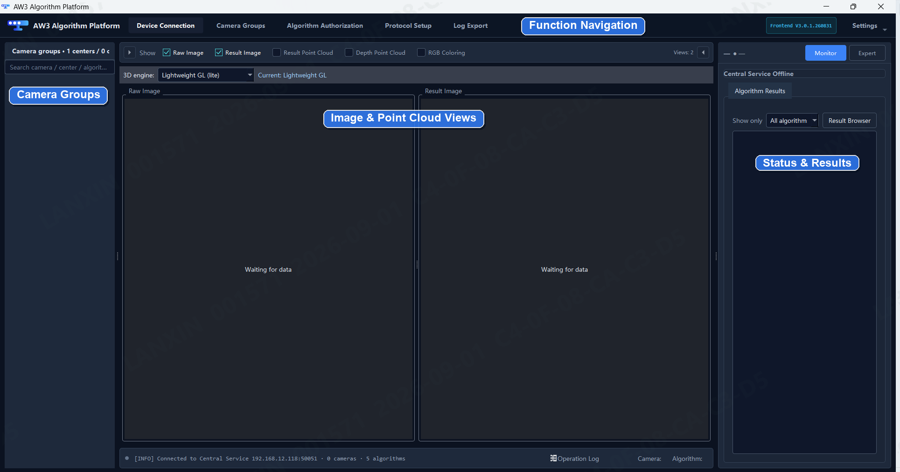
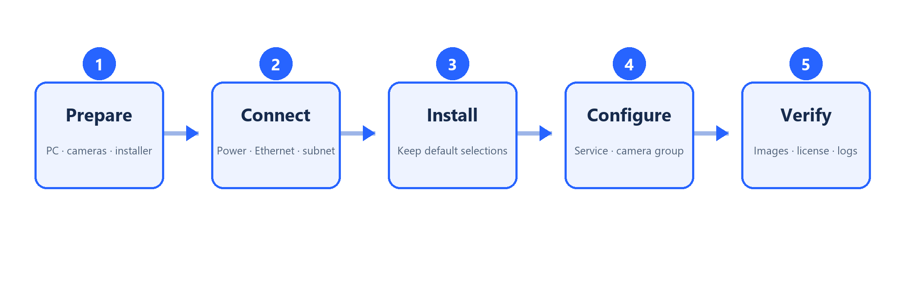
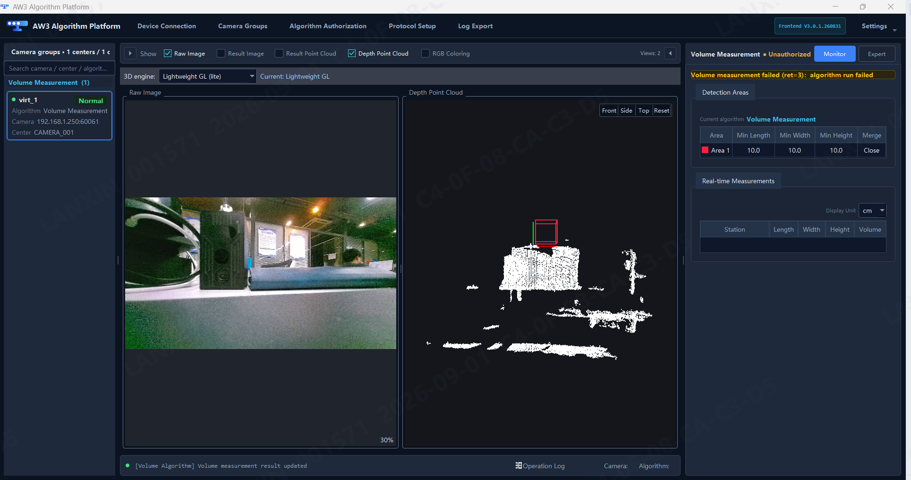

[Documentation Home](../README.md) / AW3

# AW3 Application Algorithm Platform

**Industrial vision deployment for device integration, algorithm operation, and system management.**

<table>
  <tr>
    <td width="66%" valign="top">
      <strong>One platform for application algorithm deployment</strong>  
      AW3 connects devices, manages camera groups, displays RGB images and depth point clouds, controls algorithm authorization, configures communication protocols, and exports diagnostic logs. The delivered package and license determine which algorithms and features are available.  
      
    </td>
    <td width="34%" valign="top">
      <strong>Release status</strong>  
      <strong>Latest documentation</strong> 
      <code>V0.1</code> · 2026-08-31 
      User Manual: <a href="docs/aw3-application-algorithm-platform-user-manual-v0.1.pdf">English</a> · <a href="docs/aw3-application-algorithm-platform-user-manual-zh-cn-v0.1.pdf">中文</a>  
      <strong>Latest formal software</strong> 
      Not published 
      Next window: End of September 2026 
      Version: <code>TBC</code>  
      <strong>Planned application scope</strong> 
      <a href="../volume-measurement/README.md">Volume Measurement</a>  
      <a href="#software-update-history"><strong>View update history ↓</strong></a>
    </td>
  </tr>
</table>

## Deployment workflow

AW3 follows a five-stage deployment path: prepare the host and cameras, connect the Central Service and devices, install the selected components, configure the licensed application, and verify images, point clouds, results, and logs.

  

## Core capabilities

| Capability | Purpose |
| --- | --- |
| Device connection | Connect the Central Service, discover base cameras, and verify device status. |
| Camera groups | Group one or more cameras and assign the licensed application used by the project. |
| Image and point-cloud view | Check live RGB data, depth point clouds, and application results before commissioning. |
| Algorithm authorization | Generate license requests, apply license keys, and verify validity periods. |
| System configuration | Configure display options, language, operating mode, and Central Service upgrades. |
| Communication protocol | Receive external triggers and forward structured results to external systems. |
| Log and data export | Export selected diagnostic categories and time ranges for support and maintenance. |

  

## Supported applications

| Application | Current public delivery | AW3 direction |
| --- | --- | --- |
| [**Depalletizing**](../depalletizing/README.md) | Legacy standalone `3.0.1` package | Target AW3 application |
| [**Pallet Docking**](../pallet-docking/README.md) | Legacy standalone PalletPro `1.4.8_260828` | Target AW3 application |
| [**Volume Measurement**](../volume-measurement/README.md) | Documentation `V0.1`; software not published | Planned with the next AW3 formal release |
| [**Slot Monitoring**](../slot-monitoring/README.md) | User guide published; software not published | Target AW3 application |

Obstacle Avoidance follows a separate dedicated host-application lifecycle and is not part of the AW3 delivery model recorded here.

## Start here

<table>
  <thead>
    <tr>
      <th width="620" align="left">Step</th>
      <th width="240" align="left">Link</th>
    </tr>
  </thead>
  <tbody>
    <tr>
      <td>1. Prepare, install, and connect AW3</td>
      <td>User Manual: <a href="docs/aw3-application-algorithm-platform-user-manual-v0.1.pdf">English</a> · <a href="docs/aw3-application-algorithm-platform-user-manual-zh-cn-v0.1.pdf">中文</a></td>
    </tr>
    <tr>
      <td>2. Find cameras and verify the network</td>
      <td><a href="../tools/lxcameraviewer/README.md">LxCameraViewer</a></td>
    </tr>
    <tr>
      <td>3. Select the application workflow</td>
      <td><a href="../README.md">Application catalog</a></td>
    </tr>
  </tbody>
</table>

## Software update history

The Release status above shows the latest formal AW3 software. This table retains every planned and published platform version and the application versions delivered with it.

| AW3 version | Release date | Included applications | Release note / download |
| --- | --- | --- | --- |
| `TBC` | Planned: end of September 2026 | Volume Measurement: `TBC` | _Not published_ |

Every published AW3 version receives an immutable release note with its application manifest, compatibility, asset filename, file size, SHA-256 checksum, upgrade steps, and rollback steps.

## Document update history

| Document | Version | Publication date | Applies to | File |
| --- | --- | --- | --- | --- |
| AW3 Application Algorithm Platform Deployment User Manual | `V0.1` | 2026-08-31 | AW3 formal version: `TBC` | [English PDF](docs/aw3-application-algorithm-platform-user-manual-v0.1.pdf) · [中文 PDF](docs/aw3-application-algorithm-platform-user-manual-zh-cn-v0.1.pdf) |
