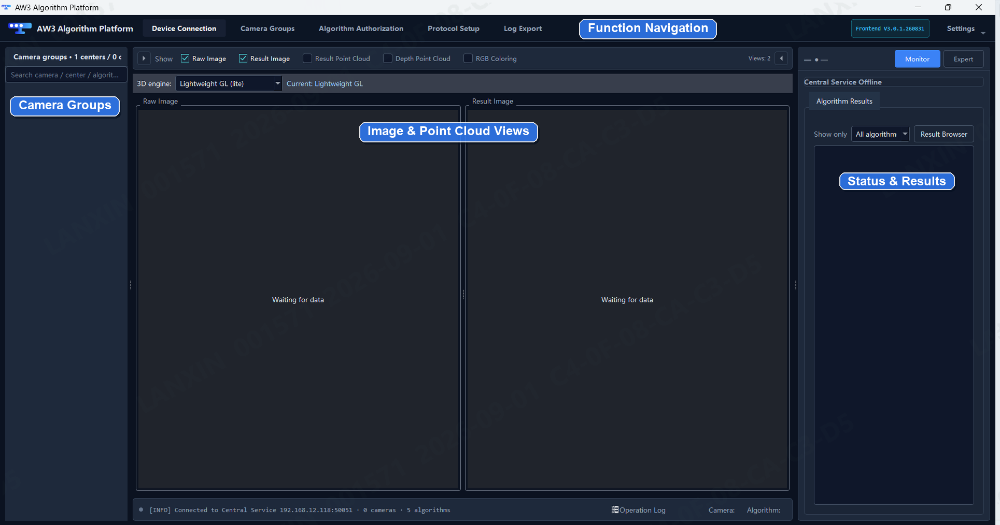
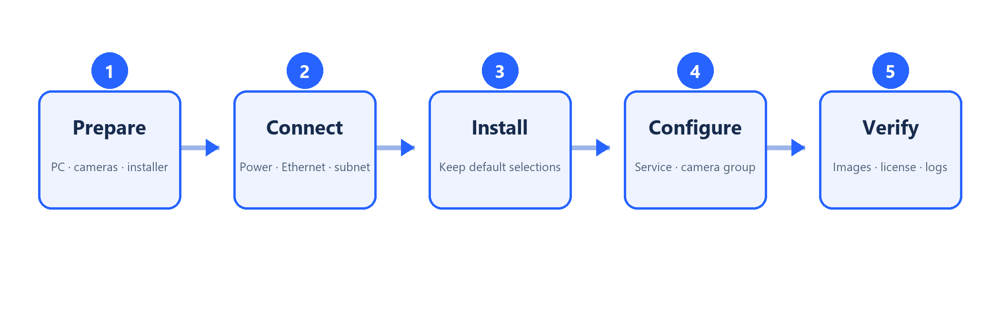
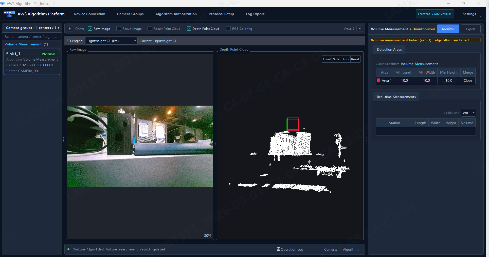

[Documentation Home](../README.md) / AW3

# AW3 Application Algorithm Platform

**Industrial vision deployment for device integration, algorithm operation, and system management.**

> **Before you update:** Check your installed AW3 and application versions against the software history below. Confirm that the User Manual applies to your deployment.

<strong>Software history · AW3 3.1.2</strong>

This table records the supplied platform and frontend history. Release-note availability does not establish public installer availability or a verified application bundle. Component versions are independent.

| Version | Scope | Release date | Release notes |
| --- | --- | --- | --- |
| `3.1.2` | Windows x64 installer; build `260929` | 2026-09-29 | [Release notes](releases/README.md#aw3-312) · [AW3 Installer](https://github.com/Lanxin-MRDVS/Application-Algorithms/releases/download/aw3-v3.1.2/AW3-V3.1.2_260929_win_x64.exe) |
| `3.1.1` | AW3Viewer frontend; build reference `20260922` | Not supplied | [Changes](releases/README.md#aw3-311) |
| `3.1.0` | Initial release and later maintenance | Not supplied | [Changes](releases/README.md#aw3-310) |
| `3.0.1` | Cumulative platform changes | Not supplied | [Changes](releases/README.md#aw3-301) |
| Legacy UI | AlgPlatformViewer; version not supplied | Not supplied | [Historical scope](releases/README.md#legacy-ui) |

All versions share one [AW3 Release Notes](releases/README.md) file. Add verified bundle manifests, compatibility, downloads, checksums, and upgrade instructions to the corresponding version section when software is published. The supplied notes were compiled on 2026-09-22; this is not a software release date.

<strong>Document history · V0.1</strong>

| Document | Version | Publication date | Applies to | File |
| --- | --- | --- | --- | --- |
| AW3 Application Algorithm Platform Deployment User Manual | `V0.1` | 2026-08-31 | AW3 platform setup; check component-specific instructions | [PDF](https://github.com/Lanxin-MRDVS/Application-Algorithms/blob/main/aw3/docs/aw3-application-algorithm-platform-user-manual-v0.1.pdf) |

<table>
  <tr>
    <td width="66%" valign="top">
      <strong>One platform for application algorithm deployment</strong>  
      AW3 connects devices, manages camera groups, displays RGB images and depth point clouds, controls algorithm authorization, configures communication protocols, and exports diagnostic logs. The delivered package and license determine which algorithms and features are available.  
      
    </td>
    <td width="34%" valign="top">
      <strong>Release status</strong>  
      <strong>Latest documentation</strong> 
      <code>V0.1</code> · 2026-08-31 
      <a href="https://github.com/Lanxin-MRDVS/Application-Algorithms/blob/main/aw3/docs/aw3-application-algorithm-platform-user-manual-v0.1.pdf">User Manual</a>  
      <strong>Latest formal software</strong> 
      AW3 <code>3.1.2</code> · 2026-09-29 
      Windows x64 · build <code>260929</code> 
      <a href="https://github.com/Lanxin-MRDVS/Application-Algorithms/releases/download/aw3-v3.1.2/AW3-V3.1.2_260929_win_x64.exe">AW3 Installer</a> · <a href="releases/README.md#aw3-312">Release notes</a>  
      <strong>Installation by application</strong> 
      Volume Measurement: frontend + backend 
      Slot Monitoring / Pallet Docking: frontend + separate algorithm package  
      <a href="#user-content-software-update-history"><strong>View software history ↑</strong></a> 
      <a href="#user-content-document-update-history">View document history ↑</a>
    </td>
  </tr>
</table>

## Deployment workflow

AW3 follows a five-stage deployment path: prepare the host and cameras, connect the Central Service and devices, install the selected components, configure the licensed application, and verify images, point clouds, results, and logs.

  

## Core capabilities

| Capability | Purpose |
| --- | --- |
| Device connection | Connect the Central Service, discover base cameras, and verify device status. |
| Camera groups | Group one or more cameras and assign the licensed application used by the project. |
| Image and point-cloud view | Check live RGB data, depth point clouds, and application results before commissioning. |
| Algorithm authorization | Generate license requests, apply license keys, and verify validity periods. |
| System configuration | Configure display options, language, operating mode, and Central Service upgrades. |
| Communication protocol | Receive external triggers and forward structured results to external systems. |
| Log and data export | Export selected diagnostic categories and time ranges for support and maintenance. |

  

## Installation

Download the [AW3 Installer](https://github.com/Lanxin-MRDVS/Application-Algorithms/releases/download/aw3-v3.1.2/AW3-V3.1.2_260929_win_x64.exe) from the AW3 software Release. Choose the components for the application you are deploying:

| Application | Required downloads | AW3 components to install |
| --- | --- | --- |
| [Volume Measurement](../volume-measurement/README.md) | [AW3 Installer](https://github.com/Lanxin-MRDVS/Application-Algorithms/releases/download/aw3-v3.1.2/AW3-V3.1.2_260929_win_x64.exe) only | Frontend and backend |
| [Slot Monitoring](../slot-monitoring/README.md#installation) | [AW3 Installer](https://github.com/Lanxin-MRDVS/Application-Algorithms/releases/download/aw3-v3.1.2/AW3-V3.1.2_260929_win_x64.exe) + [StockSync Package](https://github.com/Lanxin-MRDVS/Application-Algorithms/releases/download/stocksync-v3.1.1/AW3_camera_SDK_stocksync_full_update_rk3588_260924_3.1.1.tar.gz) | Frontend only; do not install the AW3 backend |
| [Pallet Docking](../pallet-docking/README.md#installation) | [AW3 Installer](https://github.com/Lanxin-MRDVS/Application-Algorithms/releases/download/aw3-v3.1.2/AW3-V3.1.2_260929_win_x64.exe) + [SmartDocking Package](https://github.com/Lanxin-MRDVS/Application-Algorithms/releases/download/smartdocking-v3.0.2/SmartDocking-RKU20-V3.0.2_260929_linux_arm64.tar.gz) | Frontend only; do not install the AW3 backend |

Slot Monitoring and Pallet Docking use their separate algorithm packages; these are required installation packages, not merely optional AW3 patches. Follow the package's deployment instructions for the target device. Do not install an algorithm `.tar.gz` as a Windows frontend installer.

**Package verification:** Version metadata, archive formats, and upload checksums were checked. The AW3 installer is unsigned. RKU20 and RK3588 packages are platform-specific; hardware deployment and a complete compatibility matrix have not been tested as part of this publication.

AW3 installation and component selection: [User Manual](docs/aw3-application-algorithm-platform-user-manual-v0.1.pdf).

Depalletizing retains its [legacy standalone package](../depalletizing/README.md) and remains a target AW3 application; this installation matrix does not change its delivery.

Obstacle Avoidance follows a separate dedicated host-application lifecycle and is not part of the AW3 delivery model recorded here.

## Start here

<table>
  <thead>
    <tr>
      <th width="620" align="left">Step</th>
      <th width="240" align="left">Link</th>
    </tr>
  </thead>
  <tbody>
    <tr>
      <td>1. Prepare, install, and connect AW3</td>
      <td><a href="https://github.com/Lanxin-MRDVS/Application-Algorithms/blob/main/aw3/docs/aw3-application-algorithm-platform-user-manual-v0.1.pdf">User Manual</a></td>
    </tr>
    <tr>
      <td>2. Find cameras and verify the network</td>
      <td><a href="../tools/lxcameraviewer/README.md">LxCameraViewer</a></td>
    </tr>
    <tr>
      <td>3. Select the application workflow</td>
      <td><a href="../README.md">Application catalog</a></td>
    </tr>
  </tbody>
</table>
