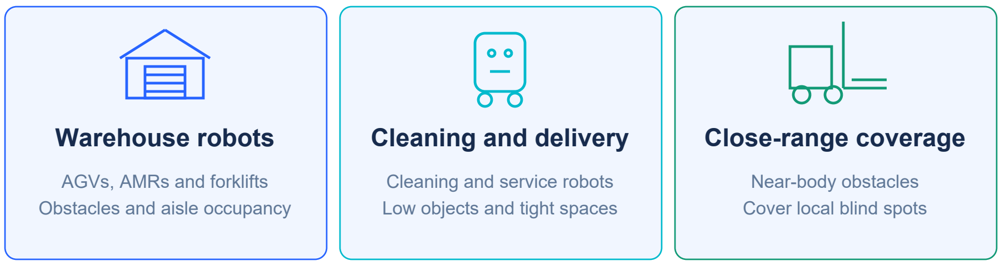
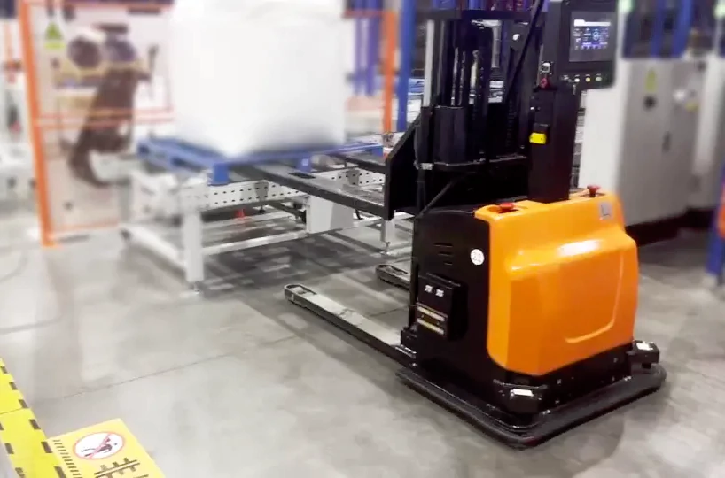
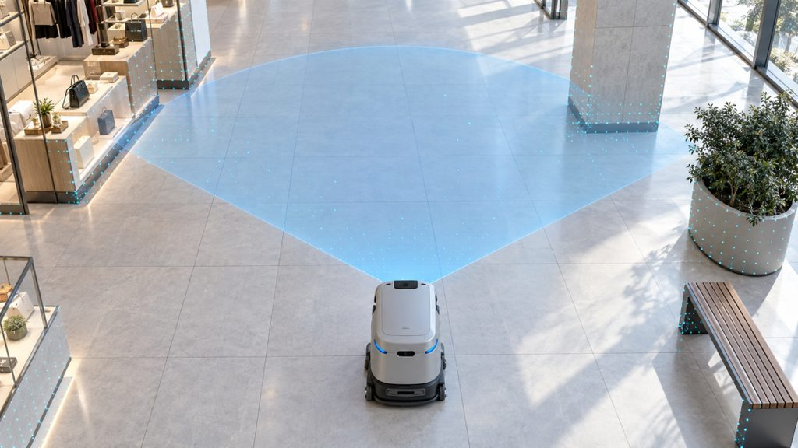
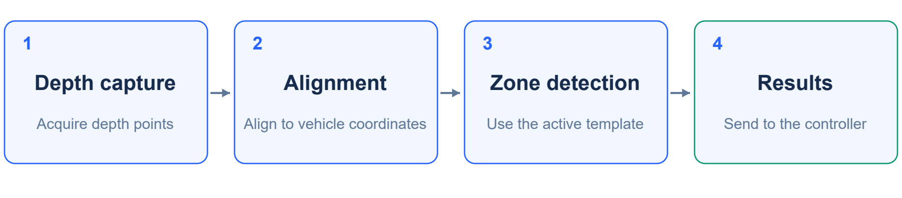
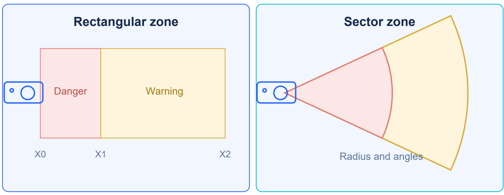
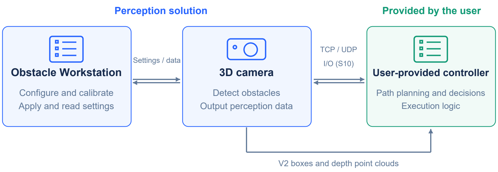

[Documentation Home](../README.md) / Obstacle Avoidance

# Obstacle Avoidance

**3D obstacle detection, configurable zones, and perception outputs for mobile robots and forklifts.**

<table>
  <tr>
    <td width="66%" valign="top">
      <strong>Designed for mobile robot perception</strong>  
      The MRDVS Obstacle Avoidance Solution detects occupied space inside configured 3D zones and reports Safe, Warning, or Alarm. Obstacle Workstation connects to the camera, supports calibration and zone configuration, and displays live results. Applications include warehouse AGVs and AMRs, forklifts, and commercial cleaning and service robots.  
        
      
       
      <small>The blue overlay illustrates coverage, not a specified detection range.</small>
    </td>
    <td width="34%" valign="top">
      <strong>Release status</strong>  
      <strong>Latest documentation</strong> 
      <code>V0.1</code> · 2026-09-21 
      <a href="https://github.com/Lanxin-MRDVS/Application-Algorithms/releases/download/aw3-obstacle-workstation-v1.0.19/obstacle-avoidance-user-manual-v0.1.pdf">User Manual</a> · <a href="https://github.com/Lanxin-MRDVS/Application-Algorithms/releases/download/aw3-obstacle-workstation-v1.0.19/obstacle-avoidance-white-paper-v0.1.pdf">White Paper</a>  
      <strong>Latest host application</strong> 
      AW3 Obstacle Workstation <code>1.0.19</code> 
      2026-09-23 · Windows x64 
      <a href="https://github.com/Lanxin-MRDVS/Application-Algorithms/releases/download/aw3-obstacle-workstation-v1.0.19/AW3ObstacleWorkstation-Setup-1.0.19-x64.exe">Windows installer</a> · <a href="https://github.com/Lanxin-MRDVS/Application-Algorithms/releases/download/aw3-obstacle-workstation-v1.0.19/aw3-obstacle-workstation-v1.0.19-release-notes.md">Release notes</a>  
      <strong>Applicable standalone updates</strong> 
      Not published  
      <a href="#software-update-history"><strong>View software history ↓</strong></a> 
      <a href="#document-update-history">View document history ↓</a>  
      <small>V1 / V2 identify camera compatibility and output features. Software package versions are recorded separately.</small>
    </td>
  </tr>
</table>

## How it works

Depth data forms a 3D point cloud. Camera alignment and ground calibration establish the spatial reference; the active template defines the zones to evaluate. Detection reports occupied space without classifying objects as people, pallets, or other categories.

  

## Outputs and capabilities

| Output or capability | Purpose |
| --- | --- |
| Zone status | Safe, Warning, or Alarm within the configured zones. |
| Rectangle and sector zones | Define danger and warning areas with distance, width or angle, and height limits. |
| Up to 20 templates | Store zone configurations with IDs 0–19 and select the active template. |
| Camera alignment and ground calibration | Align detection zones to the vehicle and floor. |
| V2 obstacle geometry | Provide obstacle bounding boxes and depth point clouds for processing in the user system. |
| TCP / UDP | Exchange zone status, validity, and template information; select templates. |
| S10 Lite physical I/O | Output digital status and select templates through wired inputs. |

  

## Camera compatibility and integration

| Camera | Algorithm family | Outputs |
| --- | --- | --- |
| S10 / S10 Lite / S11 | V1 | Zone status; physical I/O is available on S10 Lite only. |
| S10 Pro | V2 | Zone status, obstacle bounding boxes, and depth point clouds. |

S10 provides RGB images but no physical I/O. S10 Lite provides physical I/O but no RGB images.

V1 and V2 have the same zone detection capabilities and algorithm performance. TCP/UDP status packets do not contain bounding-box details or depth point clouds. With V2 Simple output enabled, the camera returns only obstacle status and the bounding-box count.

  

The original diagram retains the older label "I/O (S10)"; this interface applies to S10 Lite only, not S10.

The solution supplies perception and configuration tools. The user-provided controller implements path planning, motion decisions, and execution. Validate usable coverage, target surfaces, mounting, and the complete vehicle response. Safe status applies to the configured zones with valid depth data; it does not establish that hidden or unseen space is clear.

## Start here

<table>
  <thead>
    <tr>
      <th width="620" align="left">Step</th>
      <th width="240" align="left">Link</th>
    </tr>
  </thead>
  <tbody>
    <tr>
      <td>1. Review the application, camera, and output requirements</td>
      <td><a href="https://github.com/Lanxin-MRDVS/Application-Algorithms/releases/download/aw3-obstacle-workstation-v1.0.19/obstacle-avoidance-white-paper-v0.1.pdf">White Paper</a></td>
    </tr>
    <tr>
      <td>2. Configure the camera network and verify live data</td>
      <td><a href="../tools/lxcameraviewer/README.md">LxCameraViewer</a></td>
    </tr>
    <tr>
      <td>3. Set up Obstacle Workstation, calibrate, and validate detection</td>
      <td><a href="https://github.com/Lanxin-MRDVS/Application-Algorithms/releases/download/aw3-obstacle-workstation-v1.0.19/obstacle-avoidance-user-manual-v0.1.pdf">User Manual</a></td>
    </tr>
  </tbody>
</table>

## Software update history

Obstacle Workstation follows a dedicated host-application release lifecycle. A document version or a V1/V2 camera label does not establish a software package version.

| Version | Category | Compatible baseline | Release date | Release note / download |
| --- | --- | --- | --- | --- |
| 1.0.19 | Host application | Camera / firmware compatibility not verified | 2026-09-23 | [Release notes](https://github.com/Lanxin-MRDVS/Application-Algorithms/releases/download/aw3-obstacle-workstation-v1.0.19/aw3-obstacle-workstation-v1.0.19-release-notes.md) · [Windows installer](https://github.com/Lanxin-MRDVS/Application-Algorithms/releases/download/aw3-obstacle-workstation-v1.0.19/AW3ObstacleWorkstation-Setup-1.0.19-x64.exe) |

Published host applications and subsequent patches will be retained in this table with their verified versions, dates, compatibility, release notes, and downloads.

## Document update history

| Document | Version | Publication date | Status | Download |
| --- | --- | --- | --- | --- |
| Obstacle Avoidance Solution User Manual | V0.1 | 2026-09-21 | Current | [PDF](https://github.com/Lanxin-MRDVS/Application-Algorithms/releases/download/aw3-obstacle-workstation-v1.0.19/obstacle-avoidance-user-manual-v0.1.pdf) |
| Obstacle Avoidance Solution White Paper | V0.1 | 2026-09-21 | Current | [PDF](https://github.com/Lanxin-MRDVS/Application-Algorithms/releases/download/aw3-obstacle-workstation-v1.0.19/obstacle-avoidance-white-paper-v0.1.pdf) |
| Legacy Camera-side Deployment Guide | v0.0 archive | May 2026 | Superseded | [Markdown (ZIP)](https://github.com/Lanxin-MRDVS/Application-Algorithms/raw/refs/heads/main/obstacle-avoidance/docs/deployment-guide-v0.0.md.zip?download=1) |

v0.0 is the repository archive identifier assigned to the previous guide. Its original text, including the internal Version 1.1 label, is preserved. It is not a software release number.
