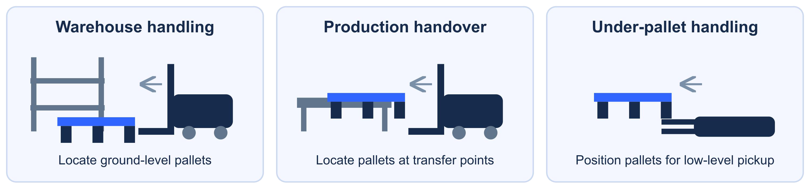
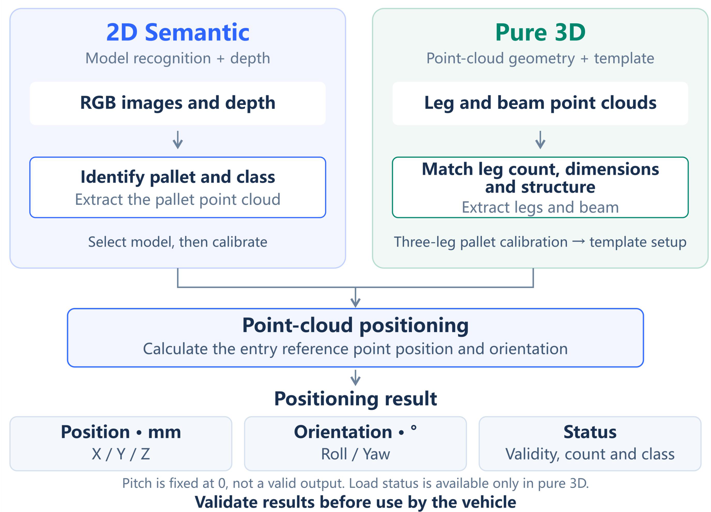

[Documentation Home](../README.md) / Pallet Docking

# SmartDocking Pallet Docking

**Pallet entry-face position, orientation, and status for autonomous forklift docking.**

> **Before you update:** Check your installed AW3 and algorithm versions against the software history below. PalletPro users should use the legacy downloads and guide for their deployment.

<strong>Legacy PalletPro</strong> · 1.4.8_260828 · downloads and user guide

PalletPro is a separate, earlier host application. It is not the AW3 frontend or the SmartDocking algorithm package. The following downloads and guide are retained for existing PalletPro deployments; their UI instructions do not describe the AW3 workflow.

| Item | Details |
| --- | --- |
| Installer | [PalletPro Installer](https://github.com/Lanxin-MRDVS/Application-Algorithms/releases/download/PalletPro/PalletPro-install-v1.4.8_260828.exe) |
| User guide | [PalletPro User Guide](docs/user-guide.md) |
| File size | 118,296,332 bytes (112.82 MiB) |
| SHA-256 | `c1bcc40900eb0c3f282c5657a7c3d06b69629483ec1674f4da347a295485dc3c` |
| Version notes | [PalletPro 1.4.8_260828](https://github.com/Lanxin-MRDVS/Application-Algorithms/blob/main/pallet-docking/releases/README.md#palletpro-148-260828) |
| Historical package | [PalletPro Archive (ZIP)](https://github.com/Lanxin-MRDVS/Application-Algorithms/releases/download/PalletPro/PalletPro_1.4.8.zip) |

<strong>Software history</strong> · SmartDocking / PalletPro

SmartDocking algorithm versions and legacy PalletPro host versions are separate components. All detailed notes remain in one [Release Notes](releases/README.md) file.

| Version | Category | Target | Publication date | Release note / download |
| --- | --- | --- | --- | --- |
| SmartDocking `3.0.2` | Device algorithm package | RKU20 / Linux ARM64; AW3 frontend | 2026-09-29 | [Notes](releases/README.md#smartdocking-302) · [SmartDocking Package](https://github.com/Lanxin-MRDVS/Application-Algorithms/releases/download/smartdocking-v3.0.2/SmartDocking-RKU20-V3.0.2_260929_linux_arm64.tar.gz) |
| PalletPro `1.4.8_260828` | Legacy standalone host | Windows | 2026-08-24 | [Notes](releases/README.md#palletpro-148-260828) · [Historical Release](https://github.com/Lanxin-MRDVS/Application-Algorithms/releases/tag/PalletPro) |

<strong>Document history</strong> · V0.1 / legacy PalletPro guide

| Document | Version | Document date | Status | Read |
| --- | --- | --- | --- | --- |
| Smart Docking User Manual | V0.1 | 2026-09-28 | Current AW3 workflow | [PDF](docs/smartdocking-user-manual-v0.1.pdf) |
| Pallet Docking Solution White Paper | V0.1 | 2026-09-28 | Current | [PDF](docs/smartdocking-white-paper-v0.1.pdf) |
| PalletPro User Guide | Original, unversioned | Not supplied | Legacy PalletPro workflow | [Markdown](docs/user-guide.md) |

<table>
  <tr>
    <td width="66%" valign="top">
      <strong>Designed for forklift pallet positioning</strong>  
      SmartDocking locates the pallet fork-entry face using 2D semantic positioning or pure 3D geometry. It supplies a reference position, orientation, and positioning status to the vehicle. AW3 manages devices, configuration, calibration, and result monitoring; the vehicle controller selects targets and controls motion and safety.  
      
    </td>
    <td width="34%" valign="top">
      <strong>Release status</strong>  
      <strong>Latest documentation</strong> 
      <code>V0.1</code> · 2026-09-28 
      <a href="docs/smartdocking-user-manual-v0.1.pdf">User Manual</a> · <a href="docs/smartdocking-white-paper-v0.1.pdf">White Paper</a>  
      <strong>Latest algorithm package</strong> 
      SmartDocking <code>3.0.2</code> 
      2026-09-29 · RKU20 / Linux ARM64 
      <a href="https://github.com/Lanxin-MRDVS/Application-Algorithms/releases/download/smartdocking-v3.0.2/SmartDocking-RKU20-V3.0.2_260929_linux_arm64.tar.gz">SmartDocking Package</a> · <a href="releases/README.md#smartdocking-302">Release notes</a>  
      <strong>Required frontend</strong> 
      <a href="https://github.com/Lanxin-MRDVS/Application-Algorithms/releases/download/aw3-v3.1.2/AW3-V3.1.2_260929_win_x64.exe">AW3 Installer</a> 
      Frontend only; no AW3 PC backend  
      <a href="#software-update-history"><strong>View software history ↑</strong></a> 
      <a href="#document-update-history">View document history ↑</a>
    </td>
  </tr>
</table>

## How it works

2D semantic positioning combines RGB model recognition with depth data. Pure 3D positioning matches leg and beam geometry against a configured template. Select and calibrate the required mode; pure 3D is an alternative method, not an automatic fallback when 2D fails.

## Outputs and capabilities

| Output or capability | Purpose |
| --- | --- |
| Entry-face reference position | X, Y, and Z in millimeters for the pallet fork-entry reference point. |
| Orientation | Roll and Yaw in degrees; Pitch is fixed at zero and is not a valid measured output. |
| Positioning status | Check validity, detected count, and available pallet-class results before vehicle use. |
| Two positioning modes | Select an appropriate semantic model or pure 3D geometry template for the site pallets. |
| Pallet templates and calibration | Maintain pallet geometry and installation-specific settings. |
| Load detection | Available in pure 3D mode when enabled; it is not a general 2D output. |

Validate the installed camera, pallet types, entry-face visibility, calibration, and complete vehicle docking behavior. Model coverage and geometry settings must match the site's pallets; this page does not claim universal recognition or collision safety.

## Installation

| Download | Target | Installation |
| --- | --- | --- |
| [AW3 Installer](https://github.com/Lanxin-MRDVS/Application-Algorithms/releases/download/aw3-v3.1.2/AW3-V3.1.2_260929_win_x64.exe) | Windows x64 PC | Install the frontend only; clear **AW3 Backend Download**. |
| [SmartDocking Package](https://github.com/Lanxin-MRDVS/Application-Algorithms/releases/download/smartdocking-v3.0.2/SmartDocking-RKU20-V3.0.2_260929_linux_arm64.tar.gz) | RKU20, Linux ARM64 | Deploy the `.tar.gz` to the matching device / center via SSH, following the User Manual. |

Both packages are required. Do not install the AW3 PC backend for this application. The algorithm archive contains the device-side service and runtime dependencies; it is not a Windows installer. Confirm the device platform before updating and back up its configuration. Hardware deployment has not been tested as part of this publication.

## Start here

<table>
  <thead><tr><th width="620" align="left">Step</th><th width="240" align="left">Link</th></tr></thead>
  <tbody>
    <tr><td>1. Review application fit and operating limits</td><td><a href="docs/smartdocking-white-paper-v0.1.pdf">White Paper</a></td></tr>
    <tr><td>2. Install the AW3 frontend and the device algorithm package</td><td><a href="#installation">Installation</a></td></tr>
    <tr><td>3. Configure, calibrate, and validate the application</td><td><a href="docs/smartdocking-user-manual-v0.1.pdf">User Manual</a></td></tr>
  </tbody>
</table>
