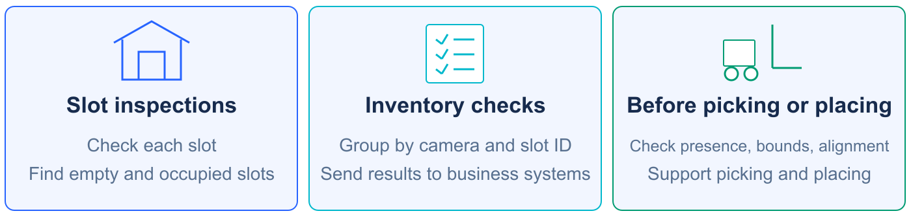
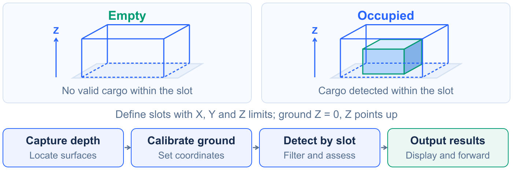

[Documentation Home](../README.md) / Slot Monitoring

# StockSync Slot Monitoring

**Slot occupancy and cargo placement for inspections, inventory checks, and picking or placing operations.**

<table>
  <tr>
    <td width="66%" valign="top">
      <strong>Designed for storage-slot inspection</strong>  
      StockSync checks whether each configured storage slot is empty or occupied. When enabled, it also reports placement quality, object dimensions, and coverage. AW3 manages slot configuration, ground calibration, and result monitoring. Inventory records, scheduling, and cargo handling remain in the customer's business system.  
        
      
    </td>
    <td width="34%" valign="top">
      <strong>Release status</strong>  
      <strong>Latest documentation</strong> 
      <code>V0.1</code> · 2026-09-24 
      <a href="docs/stocksync-user-manual-v0.1.pdf">User Manual</a> · <a href="docs/stocksync-white-paper-v0.1.pdf">White Paper</a>  
      <strong>Latest algorithm package</strong> 
      StockSync <code>3.1.1</code> 
      2026-09-29 · RK3588 / Linux ARM64 
      <a href="https://github.com/Lanxin-MRDVS/Application-Algorithms/releases/download/stocksync-v3.1.1/AW3_camera_SDK_stocksync_full_update_rk3588_260924_3.1.1.tar.gz">StockSync Package</a> · <a href="releases/README.md#stocksync-311">Release notes</a>  
      <strong>Required frontend</strong> 
      <a href="https://github.com/Lanxin-MRDVS/Application-Algorithms/releases/download/aw3-v3.1.2/AW3-V3.1.2_260929_win_x64.exe">AW3 Installer</a> 
      Frontend only; no AW3 PC backend  
      <a href="#software-update-history"><strong>View software history ↓</strong></a> 
      <a href="#document-update-history">View document history ↓</a>
    </td>
  </tr>
</table>

## How it works

The camera captures depth data. Ground calibration establishes the spatial reference, and each slot is defined by its 3D bounds. The algorithm filters the scene, detects cargo within each slot, and returns occupancy and the enabled measurements.

## Outputs and capabilities

| Output or capability | Purpose |
| --- | --- |
| Empty / occupied | Indicate whether valid cargo is detected within the configured slot. |
| Placement quality | When enabled, distinguish normal, misaligned, and out-of-bounds placement. |
| Dimensions | Report the object's bounding dimensions when measurement is enabled. |
| Coverage | Report the portion of the slot footprint occupied by cargo. |
| Multiple slots | Configure multiple slots per camera; cameras detect independently. |
| AW3 configuration and results | Calibrate, configure slots, inspect results, and forward data to business systems. |

The white paper specifies S10 Pro as the standard camera. Confirm the device platform against the **RK3588** package before installation. Validate occupancy and dimensional performance separately at the actual mounting height, lighting, and cargo conditions. Occlusion and very dark surfaces can affect detection; highly reflective objects are outside the documented operating conditions.

## Installation

| Download | Target | Installation |
| --- | --- | --- |
| [AW3 Installer](https://github.com/Lanxin-MRDVS/Application-Algorithms/releases/download/aw3-v3.1.2/AW3-V3.1.2_260929_win_x64.exe) | Windows x64 PC | Install the frontend only; clear **AW3 Backend Download**. |
| [StockSync Package](https://github.com/Lanxin-MRDVS/Application-Algorithms/releases/download/stocksync-v3.1.1/AW3_camera_SDK_stocksync_full_update_rk3588_260924_3.1.1.tar.gz) | RK3588, Linux ARM64 | Deploy the `.tar.gz` to the matching device / center via SSH, following the User Manual. |

Both packages are required. Do not install the AW3 PC backend for this application. The algorithm archive contains the device-side service and runtime dependencies; it is not a Windows installer. Confirm the device platform before updating and back up its configuration. Hardware deployment has not been tested as part of this publication.

## Start here

<table>
  <thead><tr><th width="620" align="left">Step</th><th width="240" align="left">Link</th></tr></thead>
  <tbody>
    <tr><td>1. Review application fit and operating limits</td><td><a href="docs/stocksync-white-paper-v0.1.pdf">White Paper</a></td></tr>
    <tr><td>2. Install the AW3 frontend and the device algorithm package</td><td><a href="#installation">Installation</a></td></tr>
    <tr><td>3. Configure, calibrate, and validate the application</td><td><a href="docs/stocksync-user-manual-v0.1.pdf">User Manual</a></td></tr>
  </tbody>
</table>

## Software update history

The full device update includes StockSync, camera SDK libraries, and the device service. AW3 frontend and device-side versions are independent. Detailed changes remain in one [Release Notes](releases/README.md) file.

| Version | Category | Target | Publication date | Release note / download |
| --- | --- | --- | --- | --- |
| StockSync `3.1.1` | Full device update; build 2026-09-24 | RK3588 / Linux ARM64; AW3 frontend | 2026-09-29 | [Notes](releases/README.md#stocksync-311) · [StockSync Package](https://github.com/Lanxin-MRDVS/Application-Algorithms/releases/download/stocksync-v3.1.1/AW3_camera_SDK_stocksync_full_update_rk3588_260924_3.1.1.tar.gz) |

## Document update history

| Document | Version | Document date | Status | Read |
| --- | --- | --- | --- | --- |
| StockSync User Manual | V0.1 | 2026-09-24 | Current AW3 workflow | [PDF](docs/stocksync-user-manual-v0.1.pdf) |
| StockSync White Paper | V0.1 | 2026-09-24 | Current | [PDF](docs/stocksync-white-paper-v0.1.pdf) |
| Camera-side User Guide | Original, unversioned | Not supplied | Legacy reference | [Markdown](docs/user-guide.md) |
