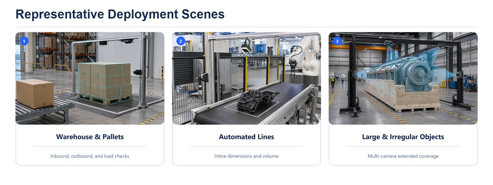
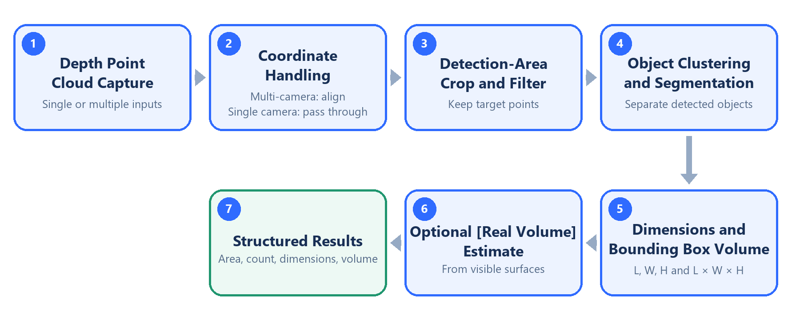
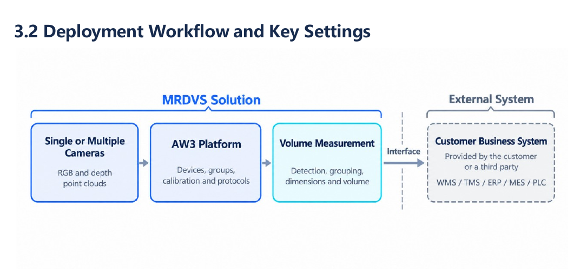

[Documentation Home](../README.md) / Volume Measurement

# TorusMetric Volume Measurement

**AW3-based 3D dimension and volume measurement for fixed stations, large objects, and multi-camera layouts.**

<table>
  <tr>
    <td width="66%" valign="top">
      <strong>Designed for operational 3D measurement</strong>  
      TorusMetric turns calibrated RGB-D point clouds into repeatable object dimensions and volume data. It is designed for fixed measurement stations in warehouses and automated lines, including palletized goods, packages, and large or irregular rigid objects. A single AW3 project can use one or multiple cameras and configure up to five detection areas.  
      
    </td>
    <td width="34%" valign="top">
      <strong>Release status</strong>  
      <strong>Latest documentation</strong> 
      <code>V0.1</code> · 2026-09-09 
      Formal version: <code>TBC</code> 
      <a href="https://github.com/Lanxin-MRDVS/Application-Algorithms/releases/download/Documentation/torusmetric-user-manual-v0.1.pdf">User Manual</a> · <a href="https://github.com/Lanxin-MRDVS/Application-Algorithms/releases/download/Documentation/torusmetric-white-paper-v0.1.pdf">White Paper</a>  
      <strong>Latest formal software</strong> 
      Version: <code>TBC</code> · Planned 
      AW3: <code>TBC</code> · End of September 2026  
      <strong>Applicable standalone updates</strong> 
      Not published  
      <a href="#software-update-history"><strong>View update history ↓</strong></a>  
      <small>Formal software is delivered with AW3. Only active updates for the latest formal version are shown here.</small>
    </td>
  </tr>
</table>

## How it works

The application captures one or more depth point clouds, applies the AW3 calibration, filters each detection area, separates objects, and calculates structured results. The optional **Real Volume** estimate uses surfaces visible to the cameras; it does not represent net material volume.

  

## Outputs and capabilities

| Output or capability | Purpose |
| --- | --- |
| Length, width, and height | Centimeter-class dimensioning for packaging, loading, and space assessment. |
| Bounding-box volume | Occupied-space estimate calculated from object dimensions. |
| Real Volume | Optional visible-surface estimate for supported project scenarios. |
| Multi-camera stitching | Extends coverage and reduces blind spots for large or oversized objects. |
| Multiple detection areas | Supports one to five areas with per-object or merged output. |
| Structured data output | Sends configured results to WMS, TMS, ERP, MES, PLC, or another project system. |

Final performance depends on the installation, camera layout, point-cloud quality, calibration, object surface, occlusion, and project acceptance criteria. TorusMetric is intended for centimeter-class operational measurement, not millimeter metrology, billing, or net material volume. Validate representative and boundary samples in the final layout.

## AW3 deployment

AW3 manages devices, camera groups, calibration, application settings, monitoring, and protocol output. TorusMetric runs as an AW3 application, calculates the measurement result, and passes configured data to the customer's business system.

  

## Start here

<table>
  <thead>
    <tr>
      <th width="620" align="left">Step</th>
      <th width="240" align="left">Link</th>
    </tr>
  </thead>
  <tbody>
    <tr>
      <td>1. Review product fit</td>
      <td><a href="https://github.com/Lanxin-MRDVS/Application-Algorithms/releases/download/Documentation/torusmetric-white-paper-v0.1.pdf">White Paper</a></td>
    </tr>
    <tr>
      <td>2. Verify camera data</td>
      <td><a href="../tools/lxcameraviewer/README.md">LxCameraViewer</a></td>
    </tr>
    <tr>
      <td>3. Deploy and validate in AW3</td>
      <td><a href="https://github.com/Lanxin-MRDVS/Application-Algorithms/releases/download/Documentation/torusmetric-user-manual-v0.1.pdf">User Manual</a></td>
    </tr>
  </tbody>
</table>

## Software update history

The Release status above shows one latest formal software version and up to three active standalone updates that apply to it. This table retains every planned, published, and superseded software version.

| Version | Category | Formal baseline | AW3 | Release date | Status / supersedes | Release note / download |
| --- | --- | --- | --- | --- | --- | --- |
| `TBC` | Formal software | This version | `TBC` | Planned: end of September 2026 | Planned | _Provided by the corresponding AW3 Release_ |

- **Formal software** is delivered with AW3 and becomes the application baseline.
- **Standalone update** is a patch for a named formal baseline and compatible AW3 version. Its status shows whether it is active or superseded.

## Document update history

The Release status shows the latest document set. This table retains every published document version and its software applicability.

| Document | Version | Applies to | Publication date | Status | File |
| --- | --- | --- | --- | --- | --- |
| TorusMetric User Manual | `V0.1` | Formal: `TBC` Standalone: none AW3: `TBC` | 2026-09-09 | Current | [PDF](https://github.com/Lanxin-MRDVS/Application-Algorithms/releases/download/Documentation/torusmetric-user-manual-v0.1.pdf) |
| TorusMetric Volume Measurement Solution White Paper | `V0.1` | Formal: `TBC` Standalone: none AW3: `TBC` | 2026-09-09 | Current | [PDF](https://github.com/Lanxin-MRDVS/Application-Algorithms/releases/download/Documentation/torusmetric-white-paper-v0.1.pdf) |
