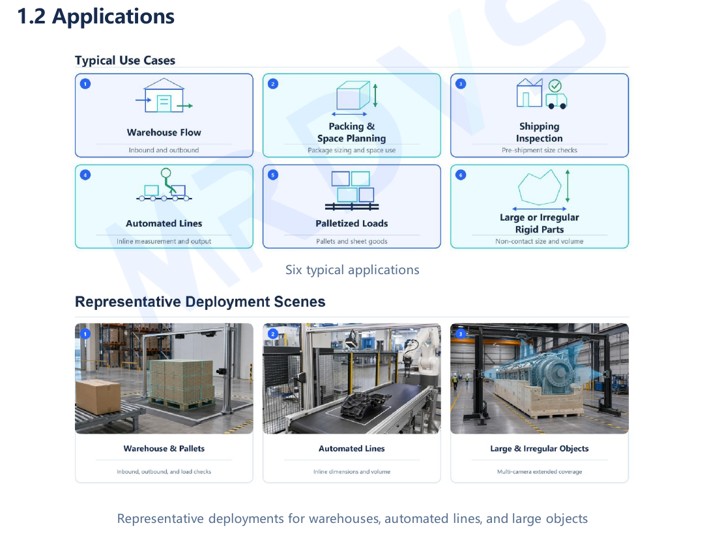
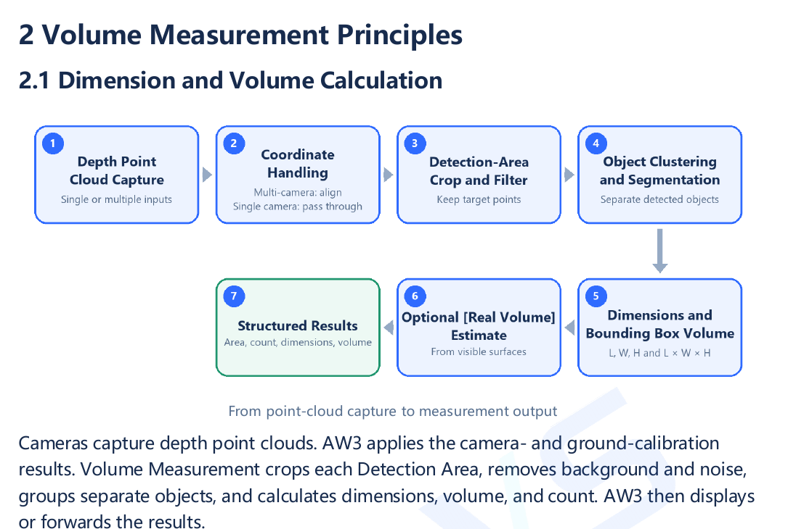

[Documentation Home](../README.md) / Volume Measurement

# TorusMetric Volume Measurement

**AW3-based 3D dimension and volume measurement for fixed stations, large objects, and multi-camera layouts.**

TorusMetric turns calibrated RGB-D point clouds into repeatable object dimensions and volume data. It is designed for fixed measurement stations in warehouses and automated lines, including palletized goods, packages, and large or irregular rigid objects. A single AW3 project can use one or multiple cameras and configure up to five detection areas.

  

## Release status

| Item | Status | Location |
| --- | --- | --- |
| Product documentation | `V0.1` · Published 2026-09-09 | [User Manual](docs/torusmetric-user-manual-v0.1.pdf) · [White Paper](docs/torusmetric-white-paper-v0.1.pdf) |
| Formal software release | Planned with the AW3 release at the end of September 2026 | [Software version history](releases/README.md) |
| Standalone application update | No public package yet | [Software version history](releases/README.md) |

No software package is linked until its AW3 release or standalone update has been published and verified.

## How it works

The application captures one or more depth point clouds, applies the AW3 calibration, filters each detection area, separates objects, and calculates structured results. The optional **Real Volume** estimate uses surfaces visible to the cameras; it does not represent net material volume.

  

## Outputs and capabilities

| Output or capability | Purpose |
| --- | --- |
| Length, width, and height | Centimeter-class dimensioning for packaging, loading, and space assessment. |
| Bounding-box volume | Occupied-space estimate calculated from object dimensions. |
| Real Volume | Optional visible-surface estimate for supported project scenarios. |
| Multi-camera stitching | Extends coverage and reduces blind spots for large or oversized objects. |
| Multiple detection areas | Supports one to five areas with per-object or merged output. |
| Structured data output | Sends configured results to WMS, TMS, ERP, MES, PLC, or another project system. |

Final performance depends on the installation, camera layout, point-cloud quality, calibration, object surface, occlusion, and project acceptance criteria. TorusMetric is intended for centimeter-class operational measurement, not millimeter metrology, billing, or net material volume. Validate representative and boundary samples in the final layout.

## AW3 deployment

AW3 manages devices, camera groups, calibration, application settings, monitoring, and protocol output. TorusMetric runs as an AW3 application, calculates the measurement result, and passes configured data to the customer's business system.

  

## Start here

| Task | Resource |
| --- | --- |
| Evaluate capabilities, scope, and operating limits | [TorusMetric White Paper V0.1](docs/torusmetric-white-paper-v0.1.pdf) |
| Install, calibrate, configure, and validate the application | [TorusMetric User Manual V0.1](docs/torusmetric-user-manual-v0.1.pdf) |
| Review document files and verification data | [Documentation index](docs/README.md) |
| Track every formal release and standalone update | [Software version history](releases/README.md) |
| Review AW3 platform releases | [AW3 release history](../aw3/releases/README.md) |
| Configure cameras and inspect point clouds | [LxCameraViewer](../tools/lxcameraviewer/README.md) |
| Integrate camera data | [CameraSDK](https://github.com/Lanxin-MRDVS/CameraSDK) |

## Release model

Every TorusMetric software version is recorded in one chronological [software version history](releases/README.md). Formal versions are delivered with AW3, so their release-note and download links point to the corresponding AW3 Release. Short-cycle updates distributed independently keep their package, checksum, compatibility, release note, and rollback guidance with this application. Earlier version rows remain available after new versions are published.
